# ENTREGA ÚNICA - Reto 01

> Exporta este archivo como **PDF único** con nombre:  
> `apellido1_apellido2_nombre_FHW01_Tarea`  *(sin ñ ni tildes)*

## Índice

- [Portada](#portada)
- [1. Introducción](#1-introduccion)
- [2. Conectores internos (energía)](#2-conectores-internos-energia)
- [3. Conectores de datos](#3-conectores-de-datos)
- [4. Slots de expansión](#4-slots-de-expansion)
- [5. Conectores externos](#5-conectores-externos)
- [6. Bibliografía](#6-bibliografia)

## Portada

## 1. Introducción

# Introducción

Piensa el PC como una **ciudad**:  
- **Conectores** = **carreteras y puentes** (energía y datos).  
- **Slots** = **parcelas** para ampliar (tarjetas).

Objetivo del reto: **identificar** y **explicar** conectores/slots **actuales** y, si procede, **legacy** aún en uso.

# Conector: 12VHPWR / 12V-2x6

**Descripción breve:** Nuevo estándar de alimentación para tarjetas gráficas PCIe de última generación. Sustituye a los conectores PCIe de 6/8 pines, permitiendo entregar hasta 600W a través de un solo cable compacto y seguro.  
**Pines/Carriles/Voltajes/Velocidad:** 16 pines (12 para potencia + 4 de “sense”) · +12V · Hasta 600W   
**Uso principal:** Alimentación exclusiva para GPUs modernas (NVIDIA RTX 40 series y futuros modelos PCIe 5.0 y superiores).    
**Compatibilidad actual:** Alta

## Identificación física
- Conector rectangular y compacto de 16 pines (12 de potencia, 4 más pequeños de detección/sense).

Etiquetado como "H+" (12VHPWR) o "H++" (12V-2x6 en la última revisión).

Conectores y cables reforzados para soportar altas cargas y evitar problemas de temperatura/mala inserción.

## Notas técnicas
- El 12VHPWR original entrega hasta 600W y 55A desde la fuente de alimentación a la GPU con líneas de +12V; el 12V-2x6 mejora seguridad y fiabilidad.

Los 4 pines “sense” detectan si el cable está correctamente insertado y configuran el límite de potencia según la fuente y GPU (300W, 450W o 600W).

El estándar 12V-2x6 introduce mejoras críticas: mejor diseño de pines, menor riesgo de sobrecalentamiento y mejor detección de inserción total, minimizando incidentes reportados con 12VHPWR.

## Fotos
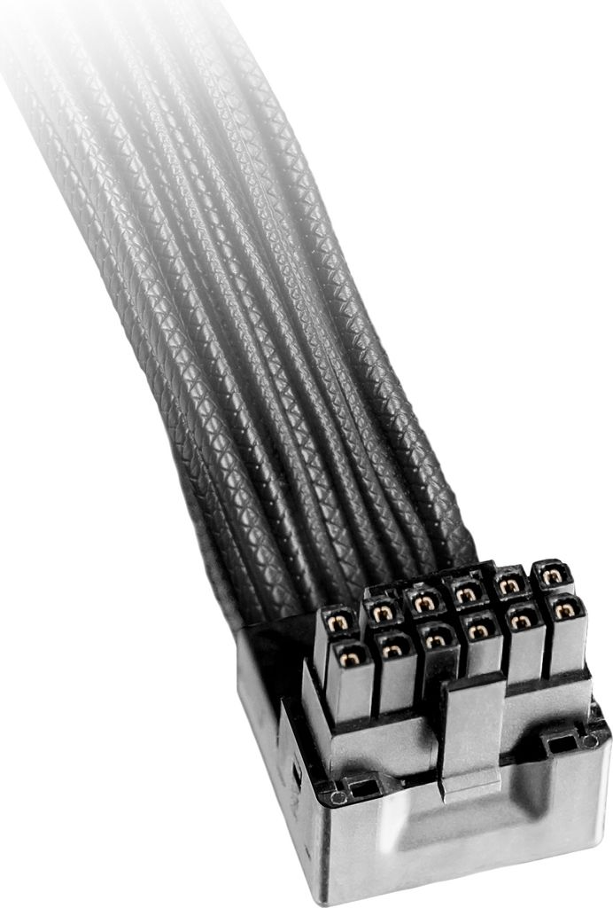

## Fuentes
- https://www.tomshardware.com/news/16-pin-power-connector-gets-a-much-needed-revision-meet-the-new-12v-2x6-connector

- https://gamertech.org/singlenews/12V-2x6

# Conector: ATX de 24 pines

**Descripción breve:** Conector principal que alimenta la placa base en sistemas ATX/ATX12V.  
**Pines/Carriles/Voltajes/Velocidad:** 24 pines · +3.3V, +5V, +12V  
**Uso principal:** Alimentación de la placa base  
**Compatibilidad actual:** Alta

## Identificación física
- Bloque rectangular de 24 pines con clip, situado en el borde de la placa base.

## Notas técnicas
- Estándar ATX12V 2.x. No confundir con el EPS de CPU (4/8 pines).

## Fotos
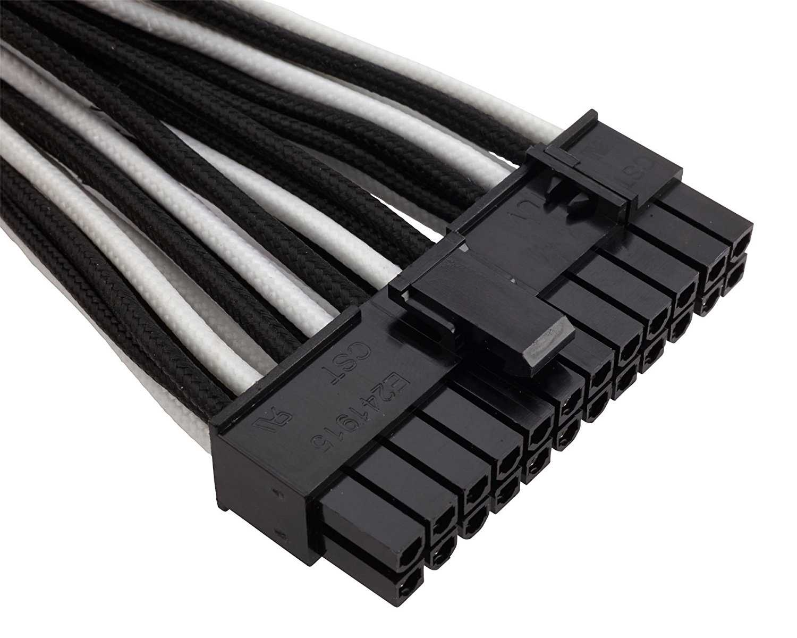

## Fuentes
- https://www.moddiy.com/pages/Power-Supply-Connectors-and-Pinouts.html

# Conector: EPS 8p (4+4)

**Descripción breve:** Conector principal que alimenta la CPU en placas base. 
**Pines/Carriles/Voltajes/Velocidad:** 8 pines (divisible 4+4) · +12V  
**Uso principal:** Alimentación directa a la CPU (procesador) mediante el conector EPS de la placa base. 
**Compatibilidad actual:** Alta

## Identificación física
- Bloque rectangular de 8 pines (puede dividirse en dos bloques de 4), con clip de seguridad, situado cerca del zócalo del procesador en la placa base.

## Notas técnicas
- Estándar EPS12V, ATX12V 2.x. No confundir con el conector PCIe de 8 pines para GPU: la posición de las muescas y el cableado es distinto.

## Fotos
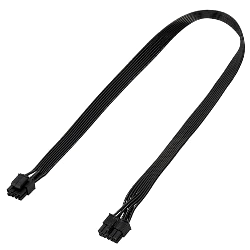

## Fuentes
- https://support.exxactcorp.com/hc/en-us/articles/20180443940119-PCIe-8-pin-vs-EPS-12V-8-pin-power-connections

# Conector: PCIe 6/8P

**Descripción breve:** Conector especializado para suministrar energía adicional a tarjetas gráficas/GPUs (PCI Express) de alto rendimiento en equipos de escritorio y workstations.
**Pines/Carriles/Voltajes/Velocidad:**  6 pines · +12V hasta 75W / 8 pines · +12V hasta 150W
**Uso principal:** Alimentación de tarjetas gráficas y otros dispositivos PCIe de alto consumo.e  
**Compatibilidad actual:** Alta

## Identificación física
- Conector rectangular de 6 pines (2 filas de 3) o de 8 pines (2 filas de 4). Suele aparecer en formato 6+2 para máxima versatilidad. Se conecta directamente a la GPU y está claramente etiquetado como PCI-e.

## Notas técnicas
- El PCIe 6 pines ofrece 75W adicionales a la GPU, mientras que el 8 pines entrega hasta 150W, gracias a dos pines extra que actúan como "sense" para informar a la gráfica de la potencia disponible.

No debe confundirse con el conector EPS 8p pese a la similitud física, ya que la disposición y cableado interno son diferentes.

Las configuraciones de GPUs de gama alta pueden requerir varios conectores de 8 pines para alcanzar mayores consumos.

## Fotos
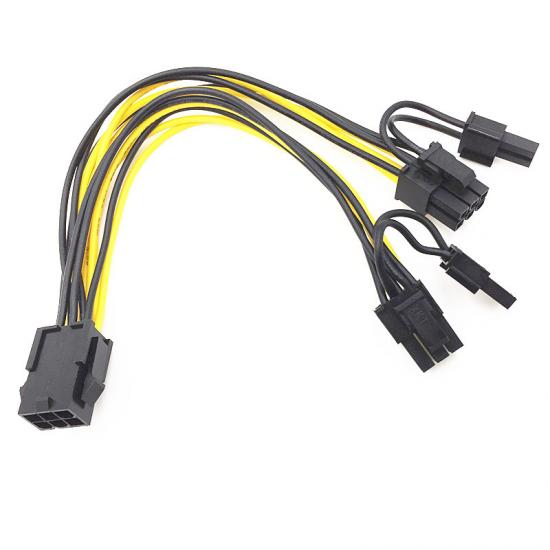

## Fuentes
- https://www.corsair.com/us/en/explorer/diy-builder/power-supply-units/individual-8-pin-vs-pigtail-connectors-for-gpus/

- https://en.wikipedia.org/wiki/PCI_Express#6-_and_8-pin_power_connectors

# Conector: SATA POWER

**Descripción breve:** Conector estándar de alimentación para discos duros, SSD y unidades ópticas con interfaz SATA. 
**Pines/Carriles/Voltajes/Velocidad:** 15 pines · +3.3V, +5V, +12V    
**Uso principal:** Alimentación de discos duros, SSD y unidades ópticas SATA. 
**Compatibilidad actual:** Alta

## Identificación física
- Conector plano y alargado de 15 pines, fácilmente distinguible por su forma y cortes rectangulares. Habitualmente se conecta al lateral de discos SATA.

## Notas técnicas
- Los 15 pines suministran tres voltajes (+3.3V, +5V, +12V) y múltiples pines para tierra, mejorando la entrega de corriente y permitiendo funciones como hot swapping.

## Fotos
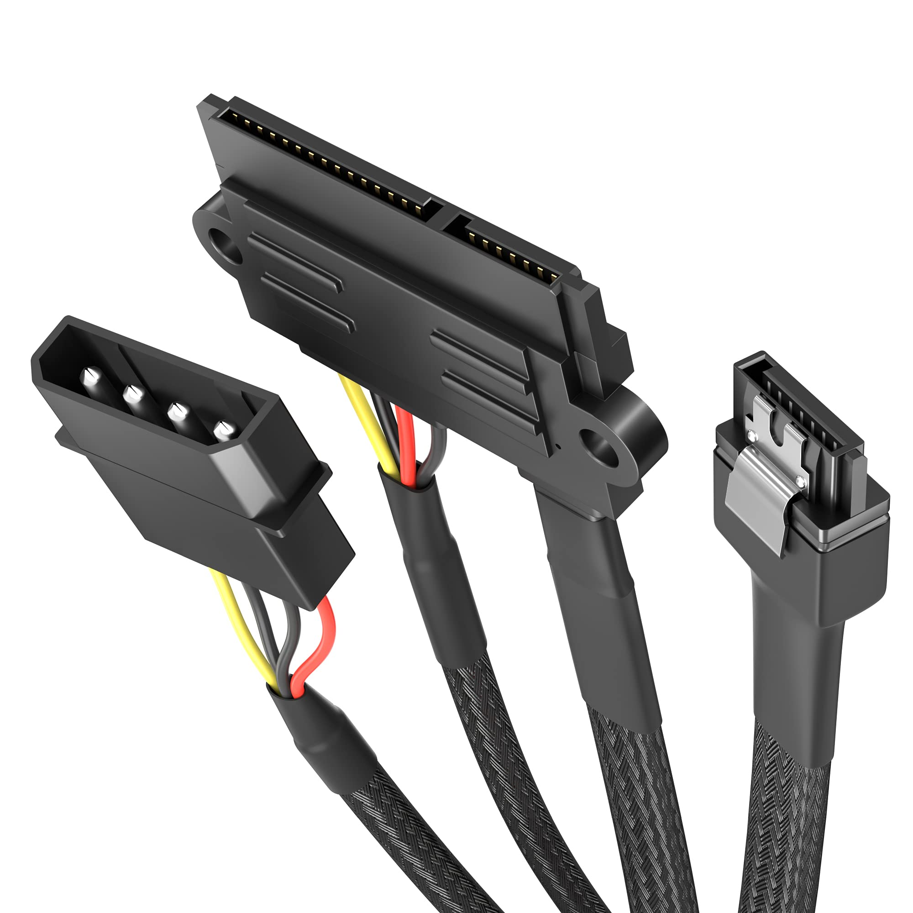

## Fuentes
- https://pinoutguide.com/Power/sata-power_pinout.shtml

## 3. Conectores de datos
# Conector de datos: M.2 (NVMe/SATA)

**Descripción breve:** Ranura de expansión interna (formato M.2) que permite conectar unidades de almacenamiento SSD tanto con interfaz SATA como NVMe (PCIe). Se usa en placas base modernas de ordenadores y portátiles, proporcionando altas velocidades de transferencia y gran versatilidad   
**Pines/Carriles/Voltajes/Velocidad:**Conectores de 67 o 75 pines según key · 3.3V (típico) · SATA hasta 6 Gbps · NVMe (PCIe) hasta 32 Gbps (PCIe 3.0 x4) o más en generaciones superiores
**Uso principal:** Conexión de discos SSD de alta velocidad, tanto SATA (opción económica/retrocompatible) como NVMe (rendimiento máximo).
**Compatibilidad actual:** Alta

## Identificación física
- Conector plano y pequeño de contactos dorados, con una muesca (key) que puede estar en el borde B, M o ambos (B+M).

Los módulos suelen indicar en la etiqueta “NVMe” o “SATA”, y la ranura de la placa base suele estar identificada con “M.2”.

## Notas técnicas
- La key determina compatibilidad:

Key B: SATA o PCIe x2

Key M: PCIe x4 (para NVMe)

Key B+M: compatible en ambos tipos de ranuras (solo a velocidad del tipo más bajo)

Para aprovechar el máximo rendimiento de NVMe, es necesaria la Key M y que la placa sea compatible PCIe 3.0/4.0 o superior.

El M.2 no tiene alimentación propia —toma energía del bus principal de la placa madre (generalmente 3.3V); no requiere cables de alimentación externos

## Fotos
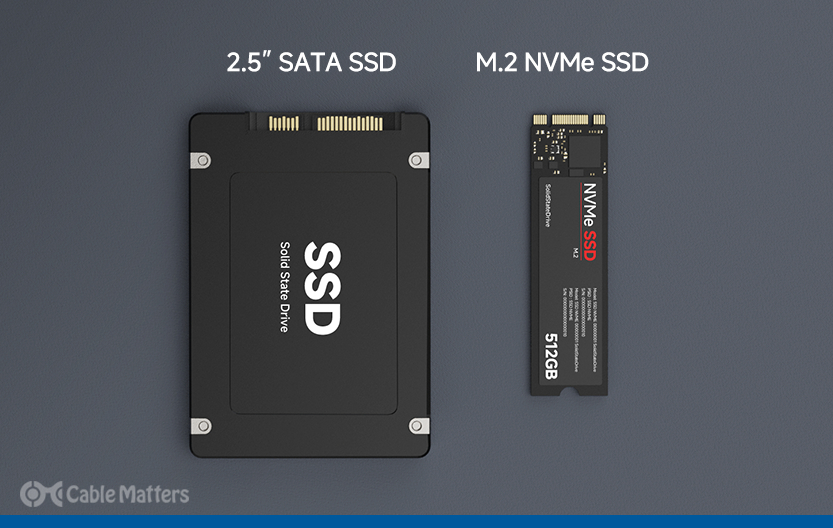

## Fuentes
- https://pinoutguide.com/HD/M.2_NGFF_connector_pinout.shtml

- https://en.wikipedia.org/wiki/M.2

-https://www.kingston.com/en/ssd/what-is-nvme-ssd-technology

# Conector de datos: SATA (Serial ATA)

**Descripción breve:** Conector estándar de transmisión de datos usado en discos duros, SSD y unidades ópticas SATA. Permite altas velocidades de transferencia y conexión sencilla hot swap.   
**Pines/Carriles/Voltajes/Velocidad:** 7 pines · Serial ATA · Velocidades desde 1.5 Gbps (SATA I) hasta 6 Gbps (SATA III)   
**Uso principal:** Conexión de almacenamiento interno moderno: HDD, SSD, lectores/grabadores SATA 
**Compatibilidad actual:** Alta

## Identificación física
- Conector plano y alargado de 7 contactos, con una muesca que impide la conexión incorrecta. Se conecta en el lateral del dispositivo de almacenamiento.

## Notas técnicas
- El cable de datos SATA se diferencia del conector de alimentación SATA (15 pines).

Permite conexión/desconexión en caliente (hot swap) según soporte de la placa/controladora.

Retrocompatible: dispositivos SATA III pueden funcionar en puertos SATA II/I y viceversa, aunque la velocidad se adapta al estándar más bajo.

## Fotos
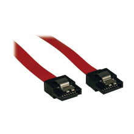

## Fuentes
- https://en.wikipedia.org/wiki/SATA

## 4. Slots de expansión
# Slot: M.2 (slot de expansión para Wi-Fi/BT, Key E)

**Descripción breve:** Ranura de expansión interna M.2 Key E específicamente destinada a módulos inalámbricos, como tarjetas Wi-Fi, Bluetooth y otros dispositivos de conectividad. Permite añadir capacidades de red inalámbrica fácilmente en placas base modernas, ordenadores de sobremesa y portátiles.
**Pines/Carriles/Voltajes/Velocidad:**Hasta 75 pines contactos · Alimentación 3.3V (típico) · PCIe x1 (hasta Gen3), USB 2.0, UART, SDIO para comunicación con el módulo
**Uso principal:**  Instalación de tarjetas/mini-módulos Wi-Fi, Bluetooth, WWAN, GPS, NFC y, ocasionalmente, módulos de almacenamiento o radio.  
**Compatibilidad actual:** Alta

## Identificación física
- Conector M.2 pequeño (Key E), con muesca lateral característica.

- Habitualmente en formatos cortos (2230, 1630 mm de largo); el slot suele estar cerca del módulo de CPU o puertos de expansión, y puede tener soportes para antenas externas.

## Notas técnicas
- Sólo módulos compatibles con Key E pueden conectarse (no compatible con Key B/M de almacenamiento).

- Permite módulos combinados Wi-Fi y Bluetooth en un solo dispositivo.

- Incluye líneas para USB, UART y, en algunos casos, interfaces adicionales como SDIO o PCIe x1 según la tarjeta utilizada.

- Algunos modelos soportan funciones avanzadas como radio FM, NFC o WAN además de Wi-Fi/Bluetooth.

## Fotos
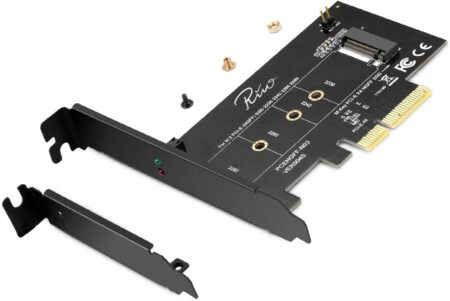

## Fuentes
- https://www.nxp.com.cn/docs/en/application-note/AN13049.pdf

- https://en.wikipedia.org/wiki/M.2 

# Slot: PCI Express x16 (Gen4/Gen5)

**Descripción breve:** Ranura de expansión de altas prestaciones usada para GPUs/aceleradoras.  
**Pines/Carriles/Voltajes/Velocidad:** x16 carriles · Gen4 16 GT/s · Gen5 32 GT/s  
**Uso principal:** Tarjetas gráficas; también aceleradoras y NVMe en adaptador  
**Compatibilidad actual:** Alta

## Identificación física
- Ranura larga con pestaña; color variable por fabricante.

## Notas técnicas
- Ancho de banda efectivo depende de generación y carriles disponibles (CPU/Chipset).

## Fotos
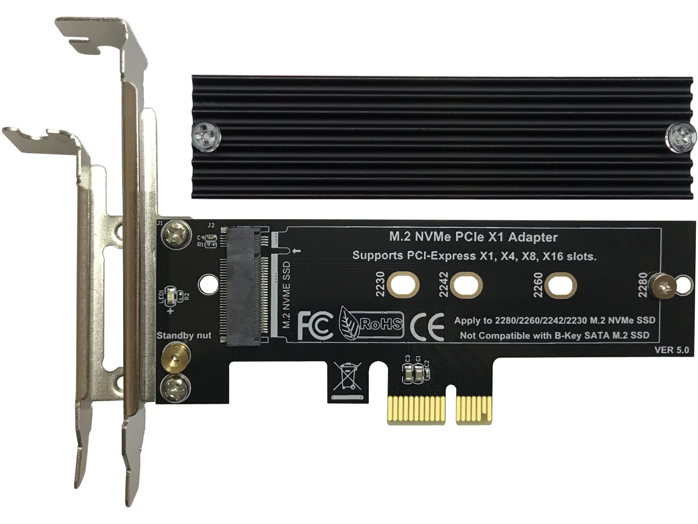

## Fuentes
- https://pinoutguide.com/Slots/pci_express_pinout.shtml

## 5. Conectores externos
# Conector externo: DisplayPort 1.4/2.x

**Descripción breve:**  Interfaz digital de vídeo y audio especialmente diseñada para monitores de alta resolución, estaciones profesionales y tarjetas gráficas. Las versiones recientes DisplayPort 1.4 y 2.x soportan resoluciones superiores a 4K, altas tasas de refresco y varias funciones avanzadas para gaming y productividad.
**Pines/Carriles/Voltajes/Velocidad:** 20 pines 
· 3.3V/500mA 
· DisplayPort 1.4 hasta 32.4 Gbps (25.9 Gbps útiles) 
· DisplayPort 2.1 hasta 80 Gbps (UHBR20, 77.4 Gbps útiles)

USB 3.x: 9 pines (5 adicionales respecto a 2.0) · +5V · Hasta 5 Gbps (USB 3.0)  
**Uso principal:** Conexión de monitores, estaciones de trabajo gráficas, GPUs, docks profesionales y pantallas de alta gama.
**Compatibilidad actual:** Muy alta. DP 2.x es retrocompatible por hardware con DP 1.4/1.2; se requiere cable certificado UHBR para mayores velocidades.

## Identificación física
- Conector plano de 20 pines, similar al USB pero más ancho.

- Disponible en tamaño estándar (“full size”) y Mini DisplayPort, ambos con 20 pines.

- El conector estándar tiene pestaña de bloqueo, en miniDP no.

- Suele ubicarse en la parte trasera de periféricos y equipos de sobremesa.

## Notas técnicas
- DisplayPort 1.4 soporta hasta 4K@120Hz y 8K@60Hz (con DSC), HDR10, audio multicanal, Multi-Stream Transport (MST) y modo alternativo por USB-C.

- DisplayPort 2.x incrementa el ancho de banda: hasta 80 Gbps, soportando 8K sin compresión y hasta 16K comprimido.

- Compatible con adaptadores pasivos a HDMI/DVI (DP++), soporta Daisy Chain y conexión multipantalla.

- Alimenta adaptadores con 3.3V/500mA desde el pin 20, soporte hot-plug.

## Fotos
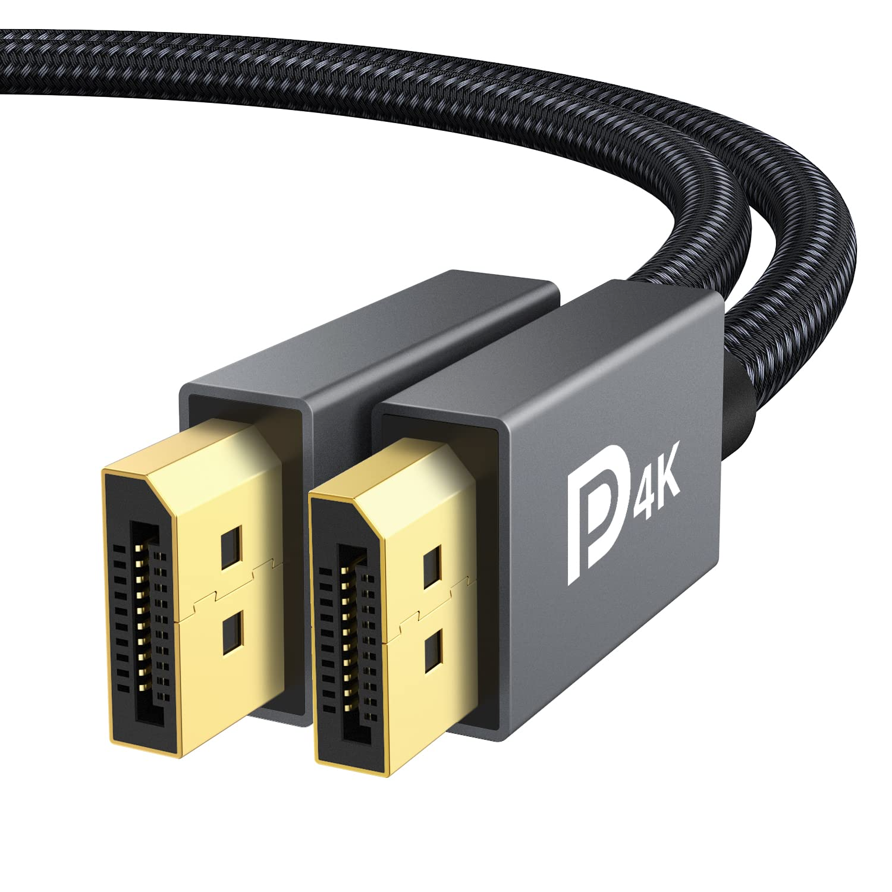

## Fuentes
- https://www.eaton.com/us/en-us/products/backup-power-ups-surge-it-power-distribution/backup-power-ups-it-power-distribution-resources/cpdi-vertical-marketing/displayport-explained.html

- https://www.eaton.com/us/en-us/products/backup-power-ups-surge-it-power-distribution/backup-power-ups-it-power-distribution-resources/cpdi-vertical-marketing/displayport-explained.html

- https://www.displayport.org/faq/

# Conector externo: HDMI 2.1

**Descripción breve:** Estándar de interfaz multimedia digital que permite transferir audio y vídeo de alta resolución sin compresión, así como datos y canal Ethernet. HDMI 2.1 es la última gran revisión, compatible con alta tasa de refresco, 8K/10K y mejoras importantes en características audiovisuales.  
**Pines/Carriles/Voltajes/Velocidad:**  19 pines (Type A, estándar) · Hasta 48 Gbps sin comprimir (FRL) · Hasta 128 Gbps comprimido (DSC) · Soporte para vídeo 4K@120Hz, 8K@60Hz, 10K · Audio digital multicanal, eARC, Dolby Atmos, HDR dinámico
**Uso principal:**  Conexión de monitores, televisores, tarjetas gráficas, consolas, barras de sonido y equipos audiovisuales de última generación.
**Compatibilidad actual:** Alta con HDMI 1.4/2.0 tanto en hardware como en cables, aunque para 8K y funciones avanzadas se requieren cables “Ultra High Speed”.

## Identificación física
- Conector plano y ancho de 19 pines, de 14 x 4,5 mm (Tipo A estándar).

- El cabezal suele estar marcado con el logo “HDMI” y la generación del cable (High Speed, Premium, Ultra High Speed).

## Notas técnicas
- HDMI 2.1 incrementa la tasa máxima hasta 48 Gbps (FRL: Fixed Rate Link) y introduce soporte para vídeo comprimido (DSC) alcanzando 128 Gbps efectivos.

- Permite 4K@120Hz, 8K@60Hz, hasta 10K en monitores de próxima generación, con HDR dinámico y soporte eARC, ALLM, QMS y VRR.

- Compatible hacia atrás; los dispositivos negociarán la máxima velocidad y características soportadas ambos lados.

- Require cables Ultra High Speed para aprovechar el ancho de banda máximo
## Fotos

## Fuentes
- https://en.wikipedia.org/wiki/HDMI

- https://www.bluejeanscable.com/articles/hdmi-2-1-cable-48g.html

- https://www.eaton.com/us/en-us/products/backup-power-ups-surge-it-power-distribution/backup-power-ups-it-power-distribution-resources/cpdi-vertical-marketing/hdmi-explained.html

# Conector externo: RJ-45 1G/2.5G/10G.

**Descripción breve:** Conector de red estándar para Ethernet sobre cable de cobre en redes domésticas, empresariales e industriales. Soporta desde redes Fast Ethernet (100 Mbps) hasta Multi-Gigabit (2.5/5/10 Gbps, según cableado y dispositivos).  
**Pines/Carriles/Voltajes/Velocidad:**  8 pines (4 pares trenzados) · Típico 3.3V señal lógica · Hasta 1 Gbps (Gigabit) con Cat5e/Cat6, hasta 10 Gbps con Cat6a/Cat7 (hasta 100m, baja atenuación)
**Uso principal:**   Conexión de ordenadores, switches, routers, puntos de acceso y dispositivos de red mediante cables Ethernet Cat5e/Cat6/Cat6a estándar.
**Compatibilidad actual:** Alta entre equipos actuales y estándar físico RJ-45; las categorías de cable definen la velocidad máxima permitida según la especificación.

## Identificación física
- Conector plástico rectangular con 8 contactos metálicos alineados y una pestaña de seguridad flexible.

- Los cables de red emplean pares trenzados, y los colores de los pines típicamente siguen los esquemas T568A o T568B.

## Notas técnicas
- Pinout estándar: T568B es el más común. Todos los pines son usados en redes gigabit (Gigabit y superiores requieren los 4 pares trenzados).

- 1G (1000BASE-T) funciona con cualquier Cat5e/Cat6 usando los 8 pines; la transmisión es full-duplex.

- 2.5G y 5G funcionan con Cat5e (a menudo a distancias menores) y Cat6; 10G requiere Cat6a o Cat7 para mantener los 100m recomendados.

- La retrocompatibilidad es integral: puedes conectar dispositivos 10G a switches 1G y funcionarán a la máxima velocidad común de ambos lados.
## Fotos

## Fuentes
- https://www.showmecables.com/blog/post/rj45-pinout

- https://zytrax.com/tech/layer_1/cables/tech_lan.htm

- https://www.taoglas.com/blogs/what-is-an-rj45-connector/

# Conector externo: USB-A 2.0/3.x

**Descripción breve:** Conector rectangular universal utilizado para la transmisión de datos y alimentación eléctrica en todo tipo de periféricos informáticos. USB 2.0 es el estándar clásico, mientras que 3.x añade pines extra para más velocidad, manteniendo la compatibilidad física hacia atrás  
**Pines/Carriles/Voltajes/Velocidad:** USB 2.0: 4 pines · +5V · 480 Mbps máx.
USB 3.x: 9 pines (5 adicionales) · +5V · hasta 5 Gbps (USB 3.0), 10 Gbps (USB 3.1), 20 Gbps (USB 3.2 Gen2x2)
**Uso principal:**  Transferencia de datos, carga/energía, conexión de teclados, ratones, memorias externas, impresoras…    
**Compatibilidad actual:** Alta (ojo: no todo USB-C soporta TB/PD)

## Identificación física
- Conector plano y rectangular de 12 mm (típico “USB clásico”), presencia en la mayoría de PCs y periféricos USB.

- USB 2.0 tiene 4 pines; los USB 3.x añaden 5 pines extra en el fondo del conector (parte posterior, no siempre visible), pero físicamente son iguales.

## Notas técnicas
- USB 2.0 solo usa 4 pines: +5V, D-, D+, GND.

- USB 3.x añade dos pares diferencial para SuperSpeed (SSTX+, SSTX−, SSRX+, SSRX−) y un pin tierra extra, logrando comunicación dúplex y mayor velocidad.

- Los dispositivos USB 2.0 funcionan sin problemas en puertos USB 3.x (y viceversa), aunque con las limitaciones de la generación más lenta
## Fotos
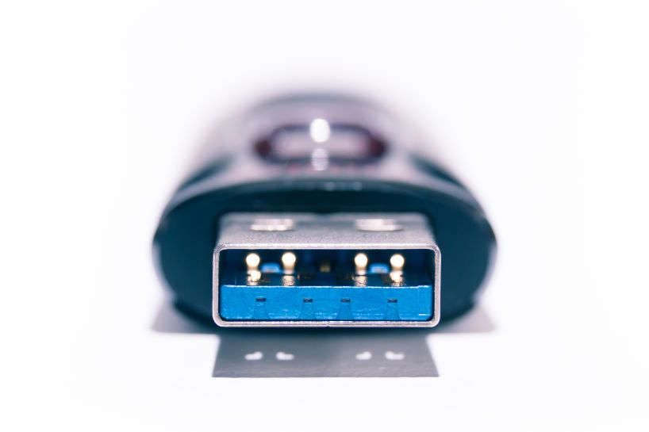

## Fuentes
- https://www.aggsoft.com/usb-pinout-cable/usb3.htm

- https://www.aikeelectronics.com/resources/usb-2-0-usb-3-0-usb-3-1-usb-3-2-usb-4-0-connectors-and-pinouts.html

- https://en.wikipedia.org/wiki/USB_hardware

# Conector externo: USB-B

**Descripción breve:**  Conector cuadrado/rectangular clásico utilizado como “puerto periférico” en impresoras, escáneres, hubs USB y otros dispositivos de sobremesa. USB-B es el conector estándar en el lado del dispositivo, mientras el host usa USB-A.
**Pines/Carriles/Voltajes/Velocidad:** USB 2.0: 4 pines · +5V · Hasta 480 Mbps

USB 3.x: 9 pines (5 adicionales respecto a 2.0) · +5V · Hasta 5 Gbps (USB 3.0)  
**Uso principal:**Enlace de impresoras, hubs USB, interfaces de audio, escáneres, algunos discos y hardware profesionals  
**Compatibilidad actual:** Alta entre dispositivos USB-B 2.0 y 3.x; los dispositivos y cables USB 3.x tienden a tener el interior del conector en azul o turquesa.

## Identificación física
- Forma cuadrada/rectangular con esquinas biseladas. USB-B 2.0 es más simple y USB-B 3.x es ligeramente más grueso (incluye una sección extra con pines de SuperSpeed).

Suele ubicarse en la parte trasera de periféricos y equipos de sobremesa.

## Notas técnicas
- USB-B 2.0 utiliza 4 pines: VBUS (+5V), D-, D+ y GND.

USB-B 3.x añade otras líneas para datos de alta velocidad (SuperSpeed), llegando a 9 pines que permiten comunicación dúplex y mayores tasas de transferencia.

USB-B mini/micro existen para equipos compactos, con variantes y formas específicas, pero el concepto de alimentación y datos es el mismo.

## Fotos
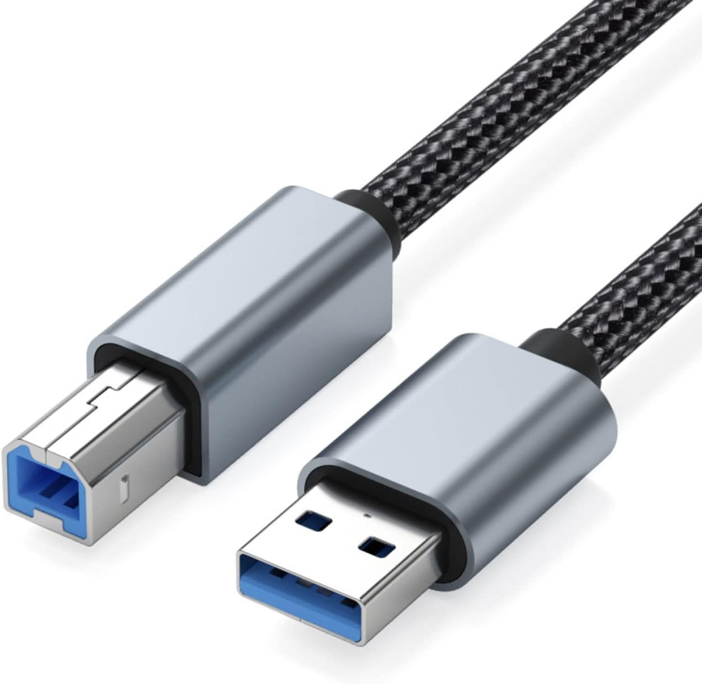

## Fuentes
- https://autowiringpro.com/usb-b-type-connector/

- https://www.aggsoft.com/usb-pinout-cable/usb2.html

# Conector externo: USB-C (USB4/PD)

**Descripción breve:** Conector reversible para datos, vídeo y alimentación (PD).  
**Pines/Carriles/Voltajes/Velocidad:** 24 pines 
· USB4 hasta 40 Gbps 
· PD hasta 100–240 W (según perfil)  
**Uso principal:** Carga y conexión de periféricos/monitores/docks  
**Compatibilidad actual:** Alta (ojo: no todo USB-C soporta TB/PD)

## Identificación física
- Ovalado y simétrico; símbolos: rayo (Thunderbolt), “SS” (SuperSpeed).

## Notas técnicas
- Requisitos de cable para 40 Gbps/240 W; DP Alt Mode para vídeo si no es TB.

## Fotos
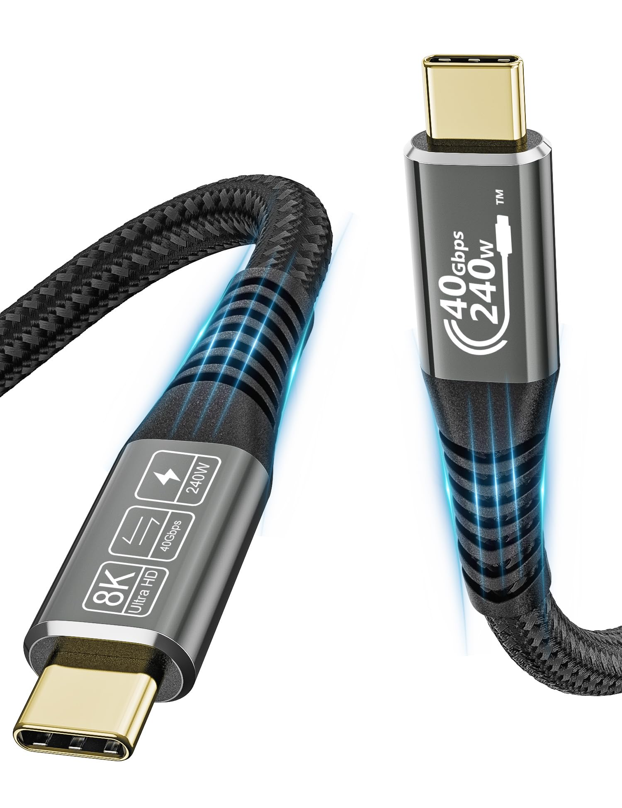
## Fuentes
- https://www.wevolver.com/article/usb-c-pinout-in-depth-a-comprehensive-technical-guide-for-engineers

- https://www.tomshardware.com/news/16-pin-power-connector-gets-a-much-needed-revision-meet-the-new-12v-2x6-connector

- https://gamertech.org/singlenews/12V-2x6

- https://www.moddiy.com/pages/Power-Supply-Connectors-and-Pinouts.html

- https://support.exxactcorp.com/hc/en-us/articles/20180443940119-PCIe-8-pin-vs-EPS-12V-8-pin-power-connections

- https://www.corsair.com/us/en/explorer/diy-builder/power-supply-units/individual-8-pin-vs-pigtail-connectors-for-gpus/

- https://en.wikipedia.org/wiki/PCI_Express#6-_and_8-pin_power_connectors

- https://pinoutguide.com/Power/sata-power_pinout.shtml