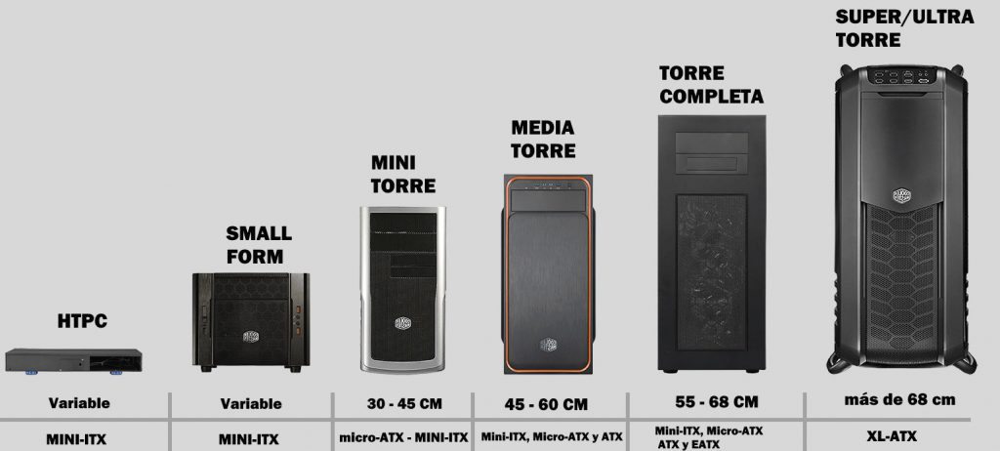

# Formatos de chasis: diagrama y análisis

**Formatos elegidos:** E-ATX, ATX, Micro-ATX y Mini ITX

## Diagrama

## Impacto del tamaño
- **Capacidad de componentes:**
E-ATX: Máxima. Permite 8-10 ranuras PCIe, hasta 10 bahías HDD/SSD, varias GPU grandes (hasta 4), fuentes de alto voltaje y todos los extras (caddy de discos, más conectores USB).
ATX: Muy alta. Admite 7 ranuras PCIe, hasta 6-8 bahías HDD/SSD, 2-3 GPU grandes y todo tipo de tarjetas de expansión.
Micro-ATX: Media. Hasta 4 ranuras PCIe, máximo 4 bahías HDD/SSD, una o dos GPU medianas y algunos extras.
Mini ITX: Limitada. Solo 1 ranura PCIe (una GPU pequeña), 1-2 bahías HDD/SSD, fuente pequeña y ninguna expansión.
- **Refrigeración:**
E-ATX: Espacio para 6–9 ventiladores grandes (120/140/200mm), soporte de radiadores XL (360/420mm), posibilidad de configuraciones custom loop complejas, excelente flujo de aire.
ATX: 4–7 ventiladores, radiadores de hasta 360mm, buen flujo para gaming/estaciones de trabajo.
Micro-ATX: 2–4 ventiladores, radiadores de hasta 240mm, flujo razonable (ideal para oficinas/silencio).
Mini ITX: 1–2 ventiladores pequeños, radiadores de hasta 120mm, flujo limitado, requiere componentes de bajo calor.
- **Uso típico:**  
E-ATX: Workstation profesional, servidores, montaje de alto rendimiento, simulación/diseño 3D, equipos para overclock/extremo.
ATX: Gaming avanzado, trabajo profesional, estudio, ofimática compleja, usuarios entusiastas.
Micro-ATX: Ofimática, gaming básico/media gama, equipos silenciosos y compactos para casa/negocio.
Mini ITX: HTPC (Home Theater PC), setups ultra compactos, equipos súper silenciosos, movilidad, escritorios pequeños.