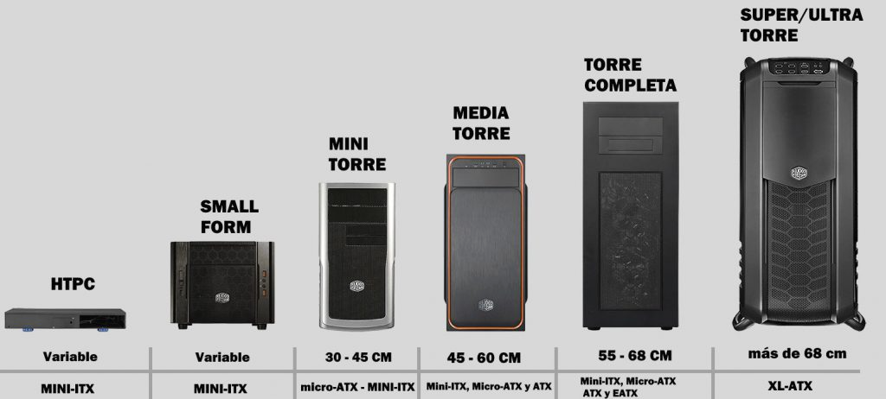

# Reto 02 — Análisis de Chasis (UT2 · RA1)

> **Instrucciones:** Copia aquí el contenido final de cada sección (puedes mantener los enlaces relativos a imágenes).

COPIAR: Portada, indice e intorducción

## 1) Tabla comparativa de materiales
# Tabla comparativa de materiales de chasis

| Material           | Ventajas (3–4)                               | Desventajas (2–3)                          | Aplicaciones comunes (ejemplos)                   |
|--------------------|-----------------------------------------------|--------------------------------------------|--------------------------------------------------|
| Acero SECC         | Muy resistente, barato, duradero              | Pesado, dificultad en modificar, oxidación | Chasis económicos de PCs, servidores y RACKS     |
| Aluminio           | Ligero, buena disipación, no se oxida, premium| Más caro, deforma con golpes               | Torres premium, disipadores, workstation         |
| Plástico           | Muy barato, ligero, no se oxida, moldeable    | Mala disipación, poco resistente           | Frontal de torres                                |
| Vidrio templado    | Estético, resistente a rayones y a presión    | Pesado, frágil ante golpes, caro           | Laterales de torres gaming y chasis inmersión    |
| Materiales comp.   | Ligero/rígido, aislamiento elec., vibración   | Caro, baja disponibilidad, difícil de repar| Chasis de alto rendimiento y custom              |

## 2) Formatos: diagrama y análisis

# Formatos de chasis: diagrama y análisis

**Formatos elegidos:** E-ATX, ATX, Micro-ATX y Mini ITX

## Diagrama

## Impacto del tamaño
- **Capacidad de componentes:**
E-ATX: Máxima. Permite 8-10 ranuras PCIe, hasta 10 bahías HDD/SSD, varias GPU grandes (hasta 4), fuentes de alto voltaje y todos los extras (caddy de discos, más conectores USB).
ATX: Muy alta. Admite 7 ranuras PCIe, hasta 6-8 bahías HDD/SSD, 2-3 GPU grandes y todo tipo de tarjetas de expansión.
Micro-ATX: Media. Hasta 4 ranuras PCIe, máximo 4 bahías HDD/SSD, una o dos GPU medianas y algunos extras.
Mini ITX: Limitada. Solo 1 ranura PCIe (una GPU pequeña), 1-2 bahías HDD/SSD, fuente pequeña y ninguna expansión.
- **Refrigeración:**
E-ATX: Espacio para 6–9 ventiladores grandes (120/140/200mm), soporte de radiadores XL (360/420mm), posibilidad de configuraciones custom loop complejas, excelente flujo de aire.
ATX: 4–7 ventiladores, radiadores de hasta 360mm, buen flujo para gaming/estaciones de trabajo.
Micro-ATX: 2–4 ventiladores, radiadores de hasta 240mm, flujo razonable (ideal para oficinas/silencio).
Mini ITX: 1–2 ventiladores pequeños, radiadores de hasta 120mm, flujo limitado, requiere componentes de bajo calor.
- **Uso típico:**  
E-ATX: Workstation profesional, servidores, montaje de alto rendimiento, simulación/diseño 3D, equipos para overclock/extremo.
ATX: Gaming avanzado, trabajo profesional, estudio, ofimática compleja, usuarios entusiastas.
Micro-ATX: Ofimática, gaming básico/media gama, equipos silenciosos y compactos para casa/negocio.
Mini ITX: HTPC (Home Theater PC), setups ultra compactos, equipos súper silenciosos, movilidad, escritorios pequeños.

## 3) Caso práctico
# Caso práctico — Recomendación de chasis

## 1) Formato recomendado
**Elección:**  
E-ATX (Torre completa)
**Justificación:**  
El formato E-ATX ofrece el mayor espacio interno posible: permite instalar hasta 10 bahías para discos HDD/SSD, varias tarjetas gráficas de gran tamaño (hasta 4 GPU largas), y una fuente de alimentación potente. La gestión de cables es mucho más fácil gracias a la amplitud y los pasacables integrados. Admite numerosos ventiladores grandes y radiadores para refrigeración líquida, asegurando un flujo de aire óptimo y componentes siempre frescos, incluso bajo carga extrema. Es el único formato realmente recomendable para workstation, servidores de diseño/simulación y labores profesionales con muchas expansiones.
## 2) Material recomendado
**Elección:**  
Aluminio con paneles de vidrio templado
**Justificación:**  
El aluminio es ligero pero muy rígido, favorece la disipación térmica y evita la oxidación, lo que reduce vibraciones y ayuda a mantener temperaturas más bajas en el interior del chasis. El acabado estético es muy superior y transmite calidad profesional. Si el presupuesto lo permite, incluir paneles laterales de vidrio templado añade robustez, resistencia a rayones y permite ver los componentes sin abrir la torre, mejorando la experiencia visual y la limpieza. Además, es un material duradero y fácil de mantener.

## 4) Reflexión personal
# Reflexión personal

Ruido del sistema:
El chasis influye mucho en el nivel de ruido que percibe el usuario. Si está construido con paneles gruesos y materiales aislantes, ayudará a bloquear vibraciones y sonidos de los ventiladores, discos duros y la fuente de alimentación. Además, un buen soporte antivibración y una estructura rígida evitarán que el chasis actúe como caja de resonancia, haciendo el equipo más silencioso.

Temperatura:
El diseño del chasis afecta directamente a la refrigeración. Si ofrece espacio suficiente para instalar varios ventiladores y radiadores grandes, el flujo de aire será mejor, permitiendo que los componentes funcionen a menor temperatura y duren más. Los filtros anti-polvo también ayudan a mantener limpio el interior y a que la refrigeración sea más eficiente.

Acceso a puertos:
Un chasis con puertos USB, audio y tarjetas en la parte frontal o superior hace que conectar dispositivos sea rápido y cómodo, sobre todo para quienes usan a menudo pendrives, auriculares o periféricos extra. Una buena accesibilidad mejora mucho la experiencia diaria y el manejo del equipo.

Estética:
Finalmente, la apariencia del chasis también importa. Materiales con buenos acabados como aluminio o vidrio templado dan sensación de calidad y pueden incorporar iluminación RGB para personalizar el PC. Un chasis bonito y bien diseñado motiva a cuidar el equipo y a disfrutar del entorno de trabajo o juego.
